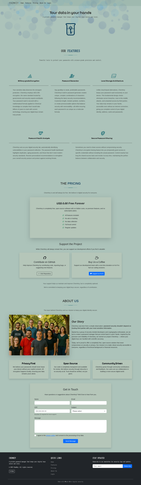

# ChemKey - The Password Manager

## About ChemKey

ChemKey is proposed to be a CLI application to run a local server that
gives you the full power of your password, cards and address information
without having to trust big Cloud companies that, from time to time,
have you information leaked.

Focused on giving the security back to you, we run a local server that
encrypts all your passwords into a file that can only be decrypted by
your user.

### Stage of development

By now (2025-04-11) this repository is a project of my undergrad class
of NodeJs. So, as a first bimester project, we only had to do little
usage of Javascript on the client side.

As soon as we dwelve further in node development, I'll constantly be
commiting to here (even adding Rust code if needed) so it can be the
repository that it claims to be - a full working cli-app to manage
your passwords and more.

## Project Description - (Class wise)

This is a  project for the "Web Scripts programming class" (ILP502).
Since this is a simpler part of the project, the professor asked us to
implement a login page, an "about the product" page and a form with CPF
validation.

Follow up to see the full development of the project.

### Screenshots

**Homepage**

**Features**

**Pricing**

**About us**

**Login page**

**App**

**Adding a Password**

**Password Generator**

